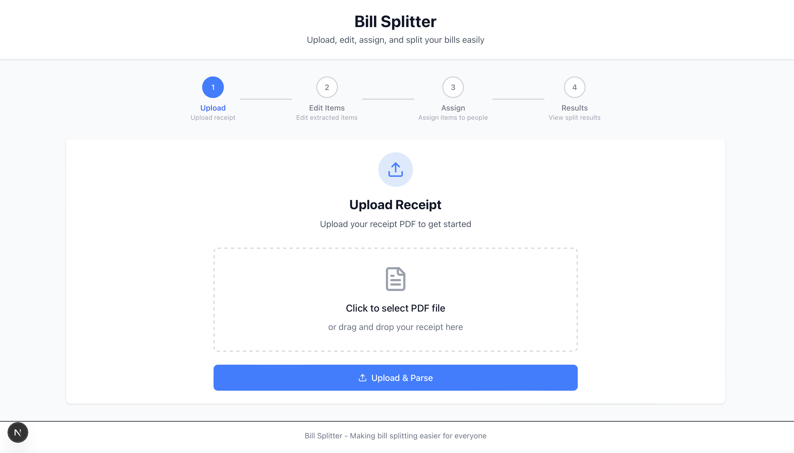

<h1 align="center">Regex-Based Pattern Matching in Digital Receipts:</h1>
<h2 align="center">Case Study on Split Bill Automation from GoFood Orders</h2>
<p align="center">
  
</p>

## Table of Contents
- [Description](#description)
- [Features](#features)
- [Requirements & Installation](#requirements--installation)
- [Author](#author)

## Description
This project automates the process of splitting a group bill from GoFood digital receipts using **regular expression (regex)** based pattern matching. It extracts item names, quantities, prices, and total amounts from a PDF receipt and distributes the total cost to each participant based on their assigned items. The system also calculates proportional discounts and fees, and generates a downloadable PDF summary.

## Features
- Upload GoFood PDF receipts
- Extract item details with regex (including multi-line support)
- Assign items to each person
- Calculate total cost per person, including discounts and handling fees
- Generate PDF report summarizing bill split

## Requirements & Installation
**1. Clone the Repository**
```bash
git clone https://github.com/carllix/split-bill-app.git
cd split-bill-app
```

### Backend
**1. Navigate to Backend**
```bash
cd backend
```

**2. Set Up a Python Virtual Environment**
**On Windows:**
```bash
python -m venv .venv
venv\Scripts\activate
```

**On macOS/Linux:**
```bash
python -m venv .venv
source venv/bin/activate
```
**3. Install Dependencies**
Install all required Python packages:
```bash
pip install -r requirements.txt
```

**4. Run the backend server**
```bash
uvicorn app.main:app --reload
```

### Frontend
**1. Navigate to frontend**
```bash
cd frontend
```
**2. Install frontend dependencies**
```bash
npm install

```
**3. Run the development server:s**
```bash
npm run dev

```

## Author

| **NIM**  | **Nama Anggota**     | **Github**                              |
| -------- | -------------------- | --------------------------------------- |
| 13523091 | Carlo Angkisan       | [carllix](https://github.com/carllix)   |
